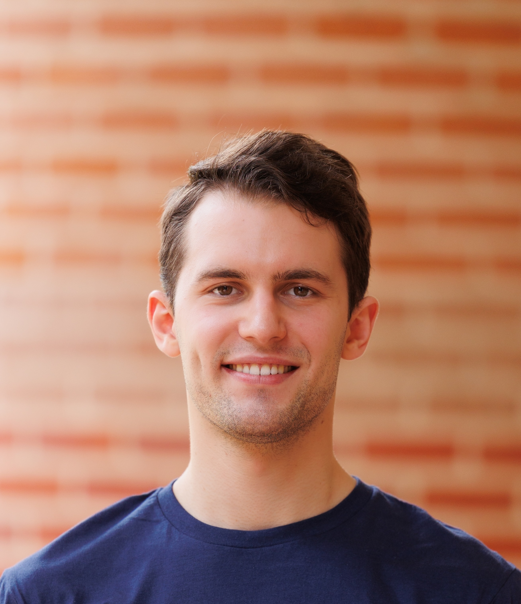

::: {.homepage}

::: {.sidebar}

<h3 class="profile-name">Fedor V. Gerasimov</h3>  
PhD student in Mathematics  
Rice University

**Email:** fg50 [at] rice [dot] edu  
**CV:** [PDF](files/CV/Fedor_Gerasimov_CV.pdf){target="_blank" rel="noopener"}  
**GitHub:** [fedor-gerasimov-50](https://github.com/fedor-gerasimov-50){target="_blank" rel="noopener"}  
**LinkedIn:** [Fedor Gerasimov](https://www.linkedin.com/in/fedor-gerasimov-450352238/){target="_blank" rel="noopener"}
:::

::: {.main-content}

## About Me

I am a PhD student in Mathematics at Rice University, advised by [Gregory Chambers](https://profiles.rice.edu/faculty/gregory-chambers){target="_blank" rel="noopener"}.

My research interests lie in discrete, convex, and computational geometry. I am especially interested in unfoldings of convex polyhedra. See [Research](contents/research/research.qmd) for more details.

Before joining the Mathematics Department, I worked in the Department of Computational Applied Mathematics and Operations Research at Rice University with [Matthias Heinkenschloss](https://profiles.rice.edu/faculty/matthias-heinkenschloss){target="_blank" rel="noopener"} on parameter identifiability and local solution manifolds of nonlinear least squares problems.

I received my M.A. in Mathematics from Rice University in 2026 and my B.Sc. in Applied Mathematics and Computer Science from the Moscow Institute of Physics and Technology in 2023. My undergraduate thesis, supervised by [Alexander Polyanskii](https://polyanskii.com/){target="_blank" rel="noopener"}, studied blocking and covering numbers of convex bodies.

## Latest News

- **August 2026** --- I received my M.A. in Mathematics from Rice University.
- **June 2026** --- I attended the [42nd International Symposium on Computational Geometry (SoCG 2026)](https://cgweek26.computational-geometry.org/){target="_blank" rel="noopener"} at Rutgers University in New Brunswick, New Jersey.
- **May 2026** --- I passed my final qualifying exam in Analysis.

:::

:::
